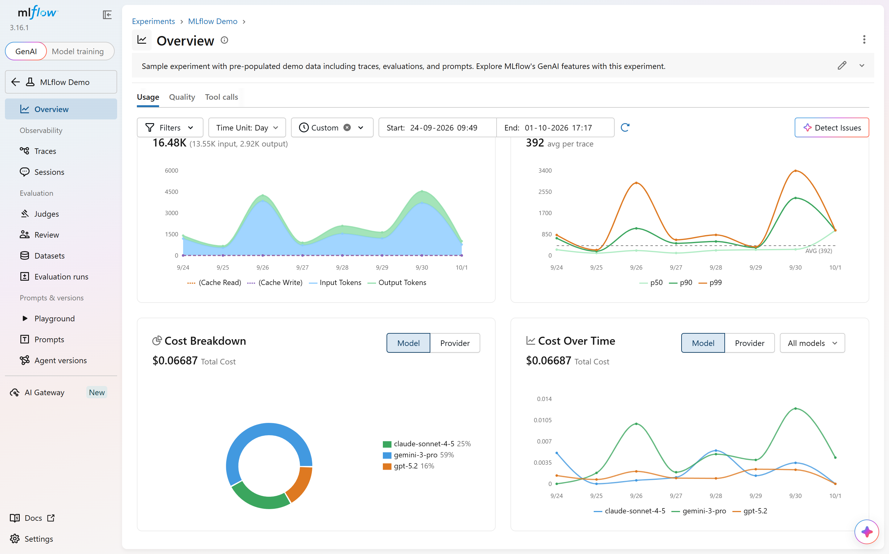
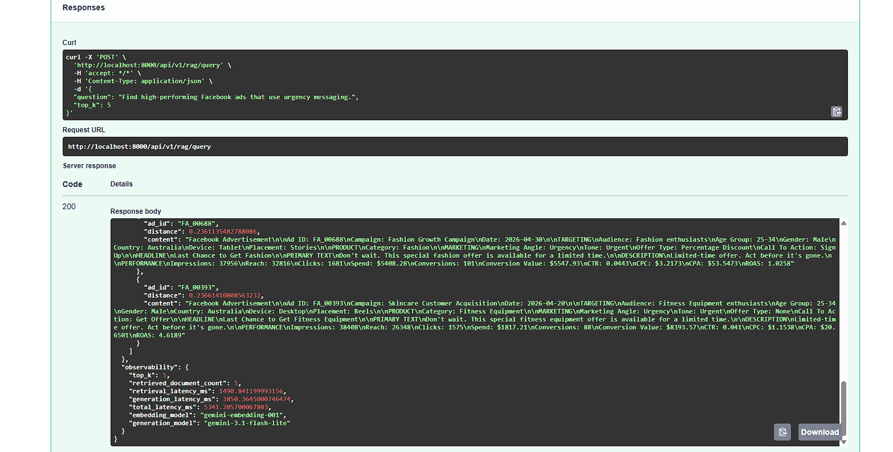
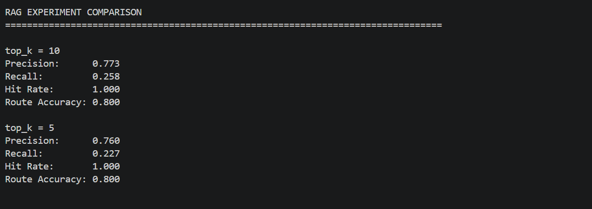

# Ads RAG LLMOps

An LLMOps project for evaluating and observing a hybrid Retrieval-Augmented Generation (RAG) system over synthetic Google Ads and Facebook Ads data.

The system combines structured advertising analytics with semantic retrieval of marketing content, uses Gemini for answer generation, evaluates retrieval quality and generated answers, and tracks experiments with MLflow.



## Overview

Advertising data contains two different types of information:

* **Structured performance data** — spend, clicks, conversions, CTR, CPA, ROAS, platform, audience, etc.
* **Unstructured marketing content** — headlines, primary text, descriptions, marketing angles, tone, offers, and messaging.

A traditional SQL-only system is useful for numerical questions but weak at semantic questions such as:

> "Which ads use urgency messaging?"

A vector-only RAG system can retrieve semantically relevant ads but is not designed for precise numerical filtering such as:

> "Find Facebook ads with ROAS above 2."

This project combines both approaches into a hybrid RAG pipeline.

## Key Capabilities

* Synthetic Google Ads and Facebook Ads dataset
* PostgreSQL database with pgvector
* SQL-based structured retrieval
* Vector-based semantic retrieval
* Hybrid SQL + vector retrieval
* Query intent extraction and routing
* Gemini-based answer generation
* Retrieval evaluation
* LLM-as-a-judge answer evaluation
* MLflow experiment tracking
* RAG observability and latency tracking
* Reproducible retrieval experiments

## Architecture

```text
                         User Question
                              |
                              v
                    +-------------------+
                    |   Query Router    |
                    | + Intent Extract  |
                    +---------+---------+
                              |
                 +------------+------------+
                 |                         |
                 v                         v
        +----------------+        +----------------+
        | SQL Retriever  |        | Vector Search  |
        |                |        |                |
        | PostgreSQL     |        | pgvector       |
        | Metrics        |        | Embeddings     |
        +-------+--------+        +-------+--------+
                |                         |
                +------------+------------+
                             |
                             v
                    +-------------------+
                    | Context Builder   |
                    +---------+---------+
                              |
                              v
                    +-------------------+
                    | Gemini Generator  |
                    +---------+---------+
                              |
                              v
                         Final Answer
                              |
                              v
                    +-------------------+
                    |    MLflow         |
                    | Evaluation +      |
                    | Observability     |
                    +-------------------+
```

## Dataset

The project uses a synthetic advertising dataset designed to resemble real campaign performance data.

The dataset contains:

* 1,000 ads
* 50 campaigns
* Google and Facebook platforms
* Impressions
* Reach
* Clicks
* Spend
* Conversions
* Conversion value
* CTR
* CPC
* CPA
* ROAS
* Audience information
* Country
* Device
* Placement
* Headlines
* Primary text
* Descriptions
* Calls to action
* Marketing angles
* Tone
* Offer type
* Product category

Marketing angles include:

* Discount
* Urgency
* Premium
* Social Proof
* Convenience
* New Arrival

The synthetic generation process intentionally introduces relationships between marketing characteristics and advertising performance so the RAG system can be evaluated against meaningful questions.

## RAG Pipeline

The system supports three retrieval routes.




### SQL Retrieval

Used for structured analytical questions such as:

```text
Which ad had the highest ROAS?

Which ad had the lowest CPA?

What is the average ROAS by marketing angle?

Which Facebook ads had the highest ROAS?
```

SQL retrieval uses PostgreSQL queries against structured advertising data.

### Vector Retrieval

Used for semantic questions such as:

```text
Which ads use urgency messaging?

Find ads using premium messaging.

Which ads use discount-focused language?
```

Marketing content is converted into embeddings using Gemini and stored in pgvector.

### Hybrid Retrieval

Hybrid questions combine structured constraints with semantic retrieval:

```text
Find high-performing Facebook ads that use urgency messaging.

Find Google ads with high ROAS that use discount messaging.

Find Facebook ads with ROAS above 2 using urgency messaging.
```

The retrieved SQL and semantic results are combined into the context supplied to Gemini.

## Embeddings

Advertising documents are embedded using:

```text
gemini-embedding-001
```

Embeddings are normalized and stored as 768-dimensional vectors in PostgreSQL using pgvector.

## Answer Generation

The final answer is generated using:

```text
gemini-3.1-flash-lite
```

The generation prompt instructs the model to:

* Use only the provided advertising data
* Avoid inventing metrics or ads
* Use supplied numerical values
* Reference actual ad copy when discussing messaging
* State when available context is insufficient
* Keep answers concise and analytical

## Evaluation

The project includes a 15-case evaluation dataset covering:

* SQL questions
* Semantic questions
* Hybrid questions

### Retrieval Metrics

The retrieval system is evaluated using:

* Precision@K
* Recall@K
* Hit Rate@K
* Route Accuracy

The evaluation also reports metrics by query type.


### Current Retrieval Experiment

Two retrieval-depth experiments were recorded:

| Configuration | Precision | Recall | Hit Rate | Route Accuracy |
| ------------- | --------: | -----: | -------: | -------------: |
| `top_k=5`     |     0.760 |  0.227 |    1.000 |          0.800 |
| `top_k=10`    |     0.773 |  0.258 |    1.000 |          0.800 |

These values describe the observed behavior of the same evaluation dataset under different retrieval depths.

The purpose of the experiment is to demonstrate reproducible RAG experimentation rather than identify a universally optimal `top_k`.



## LLM-as-a-Judge

Generated answers can be evaluated using Gemini as an LLM judge.

The answer evaluation measures:

* Faithfulness
* Relevance
* Completeness

Each dimension is scored between `0.0` and `1.0`.

The judge receives the original question, retrieved context, and generated answer and returns structured JSON containing the scores and reasoning.

## MLflow

MLflow is used to track RAG experiments and runtime behavior.

Tracked experiment:

```text
ads-rag-llmops
```

Evaluation runs include:

```text
retrieval-evaluation-top-k-5
retrieval-evaluation-top-k-10
```

Tracked parameters include:

* `top_k`
* Embedding model
* Generation model
* Retrieval strategy
* Evaluation dataset
* Evaluation case count
* Environment

Tracked metrics include:

* Precision
* Recall
* Hit Rate
* Route Accuracy
* Retrieval latency
* Generation latency
* Total pipeline latency
* Retrieved document count

Artifacts include:

* Retrieval results
* Retrieval context
* Generated answers
* Query intent
* Evaluation reports

## Observability

RAG requests expose operational metadata through the API response and MLflow.

Example observability fields:

```json
{
  "top_k": 5,
  "retrieved_document_count": 5,
  "retrieval_latency_ms": 120.5,
  "generation_latency_ms": 850.3,
  "total_latency_ms": 970.8,
  "embedding_model": "gemini-embedding-001",
  "generation_model": "gemini-3.1-flash-lite"
}
```

This makes it possible to inspect both answer behavior and operational characteristics of the RAG pipeline.

## Example Questions

### Structured

```text
Which ad had the highest ROAS?
```

### Semantic

```text
Which ads use urgency messaging?
```

### Hybrid

```text
Find high-performing Facebook ads that use urgency messaging.
```

## Project Structure

```text
Agentic-Customer-Marketing-Intelligence/
├── README.md
├── docker-compose.yml
└── backend/
    ├── README.md
    ├── .env
    ├── .env.example
    ├── requirements.txt
    ├── alembic.ini
    ├── alembic/
    │   └── versions/
    ├── app/
    │   ├── api/
    │   ├── core/
    │   ├── db/
    │   ├── evaluation/
    │   ├── observability/
    │   └── rag/
    └── scripts/
        └── README.md
```

## Tech Stack

| Area                | Technology                              |
| ------------------- | --------------------------------------- |
| API                 | FastAPI                                 |
| Language            | Python                                  |
| Database            | PostgreSQL                              |
| Vector Search       | pgvector                                |
| ORM                 | SQLAlchemy                              |
| Migrations          | Alembic                                 |
| LLM                 | Gemini                                  |
| Embeddings          | Gemini Embeddings                       |
| Evaluation          | Custom retrieval metrics + Gemini judge |
| Experiment Tracking | MLflow                                  |
| Infrastructure      | Docker                                  |
| Synthetic Data      | Faker                                   |

## Getting Started

### 1. Start PostgreSQL

From the project root:

```bash
docker compose up -d
```

### 2. Enter the backend

```bash
cd backend
```

### 3. Create and activate a virtual environment

```bash
python -m venv .venv
```

Windows:

```bash
.venv\Scripts\activate
```

Linux/macOS:

```bash
source .venv/bin/activate
```

### 4. Install dependencies

```bash
pip install -r requirements.txt
```

### 5. Configure environment variables

Copy:

```text
.env.example
```

to:

```text
.env
```

Then configure the database and Gemini API key.

### 6. Run migrations

```bash
alembic upgrade head
```

### 7. Start the API

```bash
uvicorn app.main:app --reload
```

API documentation:

```text
http://127.0.0.1:8000/docs
```

## Running Evaluation

Retrieval evaluation:

```bash
python -m scripts.evaluate_retrieval --top-k 5
```

```bash
python -m scripts.evaluate_retrieval --top-k 10
```

Compare recorded retrieval experiments:

```bash
python -m scripts.compare_rag_experiments
```

Inspect MLflow runs:

```bash
mlflow ui --backend-store-uri sqlite:///mlflow.db
```

Then open:

```text
http://127.0.0.1:5000
```

## Portfolio Story

This project demonstrates an end-to-end LLMOps workflow around a hybrid advertising analytics RAG application:

```text
Synthetic Data
      ↓
PostgreSQL + pgvector
      ↓
SQL / Vector / Hybrid Retrieval
      ↓
Gemini Generation
      ↓
Retrieval Evaluation
      ↓
LLM-as-a-Judge
      ↓
MLflow Experiments
      ↓
RAG Observability
```

The focus is not simply building a chatbot. The project treats RAG as an engineering system that can be **evaluated, compared, monitored, and iterated**.

## Future Improvements

Potential extensions include:

* More advanced query routing
* Reranking retrieved documents
* Recall@20 and ranking-based metrics
* Larger evaluation datasets
* Automated evaluation pipelines
* Production tracing
* Streaming responses
* Authentication and API security
* Real advertising platform integrations

## License

This project is intended as a portfolio and learning project under [LICENSE](LICENSE.md).
